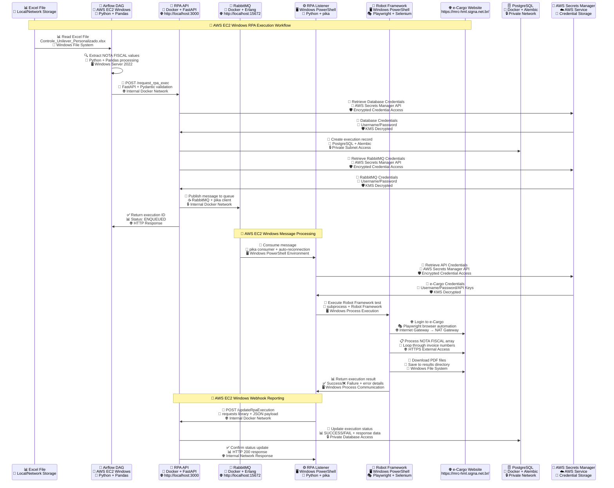
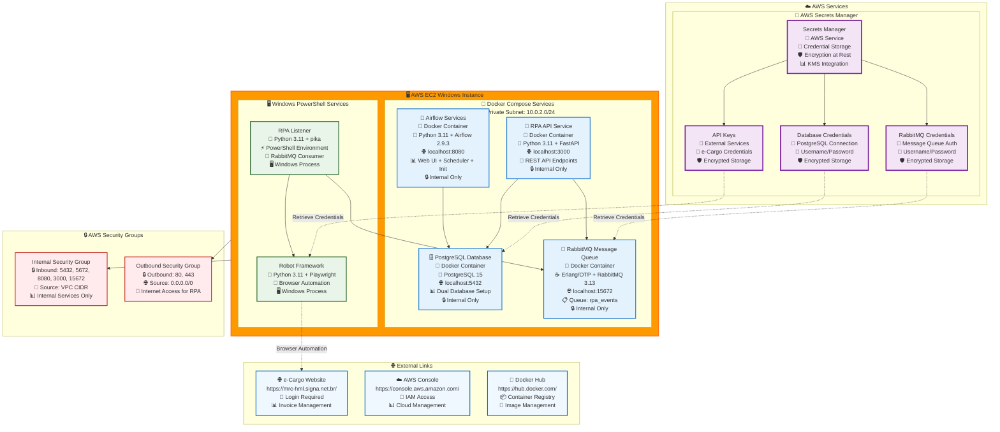

# GlobalTI RPA CMA Architecture - AWS EC2 Windows Deployment with Secrets Manager

```mermaid
graph TB
    %% External Systems
    Excel[📊 Excel File<br/>Controle_Unilever_Personalizado.xlsx<br/>📁 Data Source]
    
    %% External Links Section
    subgraph ExternalLinks["🌐 External Links"]
        ECargo[🌐 e-Cargo Website<br/>https://mrc-hml.signa.net.br/<br/>🔐 Login Required<br/>📊 Invoice Management]
        AWS_Console[☁️ AWS Console<br/>https://console.aws.amazon.com/<br/>🔐 IAM Access<br/>📊 Cloud Management]
        Docker_Hub[🐳 Docker Hub<br/>https://hub.docker.com/<br/>📦 Container Registry<br/>🔧 Image Management]
    end
    
    %% AWS VPC Architecture
    subgraph AWS["☁️ AWS Cloud Infrastructure"]
        subgraph VPC["🏢 VPC: rpa-airflow-vpc<br/>10.0.0.0/16"]
            subgraph PublicSubnet["🌐 Public Subnet<br/>10.0.1.0/24"]
                IGW[Internet Gateway<br/>🌐 External Access<br/>📡 Route Table]
                NAT[NAT Gateway<br/>🔒 Outbound Internet<br/>💰 Elastic IP]
            end
            
            subgraph PrivateSubnet["🔒 Private Subnet<br/>10.0.2.0/24"]
                subgraph EC2["🖥️ EC2 Windows Instance<br/>t3.large (2 vCPU, 8GB RAM)<br/>Windows Server 2022<br/>💾 100GB EBS Volume"]
                    
                    %% Docker Services - Individual Boxes
                    AF_Box[🔄 Airflow Services<br/>🐳 Docker Container<br/>🐍 Python 3.11 + Airflow 2.9.3<br/>🌐 localhost:8080<br/>📊 Web UI + Scheduler + Init<br/>🔒 Internal Only]
                    
                    API_Box[🚀 RPA API Service<br/>🐳 Docker Container<br/>🐍 Python 3.11 + FastAPI<br/>🌐 localhost:3000<br/>📡 REST API Endpoints<br/>🔒 Internal Only]
                    
                    PG_Box[🗄️ PostgreSQL Database<br/>🐳 Docker Container<br/>🐘 PostgreSQL 15<br/>🌐 localhost:5432<br/>📊 Dual Database Setup<br/>🔒 Internal Only]
                    
                    MQ_Box[📨 RabbitMQ Message Queue<br/>🐳 Docker Container<br/>☕ Erlang/OTP + RabbitMQ 3.13<br/>🌐 localhost:15672<br/>📋 Queue: rpa_events<br/>🔒 Internal Only]
                    
                    %% External Worker (PowerShell)
                    subgraph Worker["⚙️ RPA Listener (PowerShell Worker)"]
                        Listener[RabbitMQ Consumer<br/>🐍 Python 3.11<br/>📨 pika (RabbitMQ Client)<br/>⚡ PowerShell Environment<br/>🔄 Auto-reconnection]
                        Robot[Robot Framework<br/>🐍 Python 3.11<br/>🤖 Robot Framework<br/>🎭 Playwright Browser<br/>🌐 Selenium WebDriver]
                        Robot_Tests[Test Suite<br/>📝 ecargo_pod_download.robot<br/>🎯 Browser Automation<br/>📊 PDF Downloads]
                    end
                end
            end
        end
        
        %% AWS Secrets Manager
        subgraph SecretsManager["🔐 AWS Secrets Manager"]
            Secrets[Secrets Manager<br/>🔐 AWS Service<br/>🔑 Credential Storage<br/>🛡️ Encryption at Rest<br/>📊 KMS Integration]
            DB_Secrets[Database Credentials<br/>🔐 PostgreSQL Connection<br/>🔑 Username/Password<br/>🛡️ Encrypted Storage]
            MQ_Secrets[RabbitMQ Credentials<br/>🔐 Message Queue Auth<br/>🔑 Username/Password<br/>🛡️ Encrypted Storage]
            API_Secrets[API Keys<br/>🔐 External Services<br/>🔑 e-Cargo Credentials<br/>🛡️ Encrypted Storage]
        end
        
        %% Security Groups
        subgraph SecurityGroups["🔒 Security Groups"]
            SG_Internal[Internal Security Group<br/>🔒 Inbound: 5432, 5672, 8080, 3000, 15672<br/>🏢 Source: VPC CIDR<br/>📊 Internal Services Only]
            SG_Outbound[Outbound Security Group<br/>🔒 Outbound: 80, 443<br/>🌐 Source: 0.0.0.0/0<br/>📡 Internet Access for RPA]
        end
    end
    
    %% Data Flow Connections
    Excel --> AF_Box
    AF_Box --> API_Box
    API_Box --> MQ_Box
    MQ_Box --> Listener
    Listener --> Robot
    Robot --> Robot_Tests
    Robot_Tests --> ECargo
    
    %% Database Connections
    AF_Box --> PG_Box
    API_Box --> PG_Box
    Listener --> PG_Box
    
    %% Secrets Manager Connections
    Secrets --> DB_Secrets
    Secrets --> MQ_Secrets
    Secrets --> API_Secrets
    DB_Secrets -.->|Retrieve Credentials| PG_Box
    MQ_Secrets -.->|Retrieve Credentials| MQ_Box
    API_Secrets -.->|Retrieve Credentials| Robot
    
    %% Webhook Flow
    Robot -.->|Webhook Call<br/>🐍 requests library| API_Box
    
    %% AWS Networking
    IGW --> EC2
    NAT --> EC2
    EC2 --> SG_Internal
    EC2 --> SG_Outbound
    
    %% Styling
    classDef aws fill:#ff9900,stroke:#ff6600,stroke-width:3px
    classDef vpc fill:#e3f2fd,stroke:#1976d2,stroke-width:2px
    classDef ec2 fill:#f0f8ff,stroke:#0066cc,stroke-width:2px
    classDef docker fill:#e3f2fd,stroke:#1976d2,stroke-width:2px
    classDef airflow fill:#e1f5fe,stroke:#01579b,stroke-width:2px
    classDef api fill:#f3e5f5,stroke:#4a148c,stroke-width:2px
    classDef mq fill:#fff3e0,stroke:#e65100,stroke-width:2px
    classDef worker fill:#e8f5e8,stroke:#1b5e20,stroke-width:2px
    classDef db fill:#fce4ec,stroke:#880e4f,stroke-width:2px
    classDef external fill:#f5f5f5,stroke:#424242,stroke-width:2px
    classDef security fill:#ffebee,stroke:#c62828,stroke-width:2px
    classDef urls fill:#e8f5e8,stroke:#2e7d32,stroke-width:2px
    classDef secrets fill:#f3e5f5,stroke:#7b1fa2,stroke-width:3px
    classDef integrations fill:#fff8e1,stroke:#f57c00,stroke-width:2px
    
    class AWS aws
    class VPC,PublicSubnet,PrivateSubnet vpc
    class EC2 ec2
    class AF_Box airflow
    class API_Box api
    class MQ_Box mq
    class PG_Box db
    class Listener,Robot,Robot_Tests worker
    class Excel external
    class SG_Internal,SG_Outbound security
    class ECargo,AWS_Console,Docker_Hub urls
    class Secrets,DB_Secrets,MQ_Secrets,API_Secrets secrets
```

## AWS EC2 Windows Deployment Workflow Sequence



## AWS EC2 Windows Docker Compose Architecture with Secrets Manager



## AWS Secrets Manager Integration Details

```mermaid
graph TB
    subgraph SecretsManager["🔐 AWS Secrets Manager Integration"]
        direction TB
        
        subgraph SecretTypes["🔑 Secret Types"]
            DB_Secret[Database Secret<br/>🔐 rpa-airflow/database<br/>🔑 Username: postgres<br/>🔑 Password: encrypted<br/>🛡️ KMS Key: aws/secretsmanager]
            MQ_Secret[RabbitMQ Secret<br/>🔐 rpa-airflow/rabbitmq<br/>🔑 Username: guest<br/>🔑 Password: encrypted<br/>🛡️ KMS Key: aws/secretsmanager]
            API_Secret[API Secret<br/>🔐 rpa-airflow/api-keys<br/>🔑 e-Cargo Username<br/>🔑 e-Cargo Password<br/>🔑 API Keys<br/>🛡️ KMS Key: aws/secretsmanager]
        end
        
        subgraph AccessPatterns["🔐 Access Patterns"]
            IAM_Role[IAM Role<br/>🔐 rpa-airflow-role<br/>🛡️ SecretsManagerReadWrite<br/>📊 EC2 Instance Profile]
            KMS_Key[KMS Key<br/>🔐 aws/secretsmanager<br/>🛡️ Encryption/Decryption<br/>📊 Key Rotation]
        end
        
        subgraph Applications["🐍 Application Integration"]
            Python_SDK[boto3 SDK<br/>🐍 Python 3.11<br/>📡 AWS SDK Integration<br/>🔐 get_secret_value()<br/>🛡️ Automatic Decryption]
            Docker_Env[Docker Environment<br/>🐳 Container Variables<br/>🔐 AWS_ACCESS_KEY_ID<br/>🔐 AWS_SECRET_ACCESS_KEY<br/>🔐 AWS_DEFAULT_REGION]
        end
    end
    
    %% Connections
    IAM_Role --> DB_Secret
    IAM_Role --> MQ_Secret
    IAM_Role --> API_Secret
    KMS_Key --> DB_Secret
    KMS_Key --> MQ_Secret
    KMS_Key --> API_Secret
    Python_SDK --> IAM_Role
    Docker_Env --> Python_SDK
    
    %% Styling
    classDef secrets fill:#f3e5f5,stroke:#7b1fa2,stroke-width:2px
    classDef access fill:#e8f5e8,stroke:#2e7d32,stroke-width:2px
    classDef apps fill:#e3f2fd,stroke:#1976d2,stroke-width:2px
    
    class DB_Secret,MQ_Secret,API_Secret secrets
    class IAM_Role,KMS_Key access
    class Python_SDK,Docker_Env apps
```